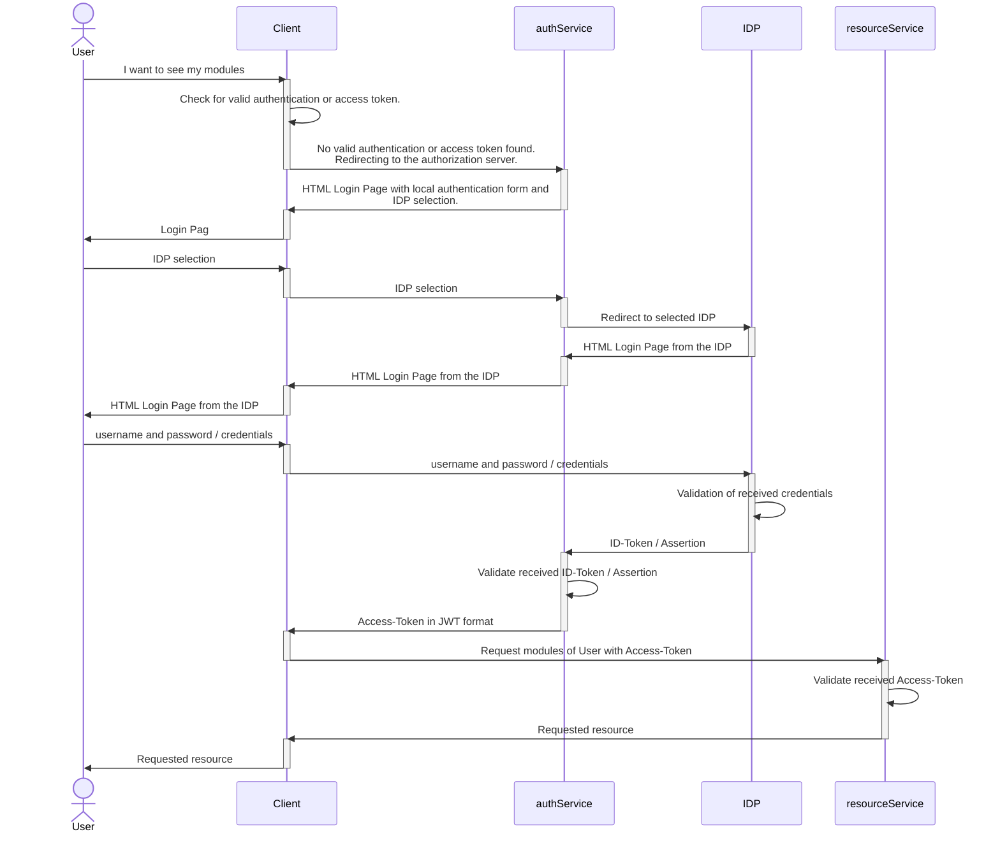

# Authorization Service

> authorization-service

The authorization server provides the necessary means to authenticate a user, before he is allowed
to access the resources of a service.
The user can authenticate himself by providing a combination of username and password,
or authenticating himself based on identity providers like Google, Facebook or BundID.
The authentication through an identity provider allows the Single Sign-on mechanism to be used as the
authentication method.

The authorization server acts primarily as an oauth compliant authorization server and identity provider,
who issues access tokens in the JWT format.
Other services can consume the access tokens in order to provide users the access to their resources.
Besides acting as the identity provider for resource servers, it also acts as an service provider to
other identity providers like Google, Facebook or BundID.

## Background information

#### Single Sign-on/Logout and Identity Providers

Single Sign-on allows a user to use one set of credentials to log in to multiple applications
without having to resubmit the same credentials each time for each application.
This is made possible by using identity providers (IDP), who share information like person name with
independent applications, also called service providers (SP).

The SPs and the IDPs exchange information about the authentication of a user, who must be authenticated before
he can access the SPs resources.

To exchange the authentication information about a user, the SP redirects the client of the user
(f.e. the browser) to an IDP, who will perform the authentication of the user for the SP.
If the user is already signed in at the IDP, he does not have to resubmit his credentials again, resulting
in a Single Sign-on.
The IDP redirects the users' client back to the SP with the necessary authentication information
which indicate that the user has successfully authenticated himself at the IDP.
The SP validates the received authentication information and grants him based on that the access to the resources.

The counterpart to Single Sign-On is the Single Logout mechanism.
When a user is logged out of an IDP, he is logged out of all SP that used the same IDP to authenticate and
log in the person who was logged out of the ID.
It is also possible to trigger the logout at the IDP, if the user logs out of an SP.

#### OAuth and OpenID-Connect

The exchange of authentication information between an IDP and an SP can be accomplished
in several ways.
One way to achieve this is to use the open standard OAuth and OpenID-Connect (OIDC).
While OAuth primarily serves as an authorization framework, the use of the OpenID-Connect allows developers
to implement authentication features.

OpenID-Connect is based on OAuth and uses a lot of concepts from that.
Both OAuth and OIDC use JSON and JSON-Web-Tokens (JWT) to exchange authentication information.
The JWTs are signed by the IDP, in order to achieve a way to allow the SP to verify the received information from an
IDP.

The necessary information about the provided endpoints for authentication and cryptographic keys in order to
verify the signature of JWTs are contained in metadata files, which can be normally found under
the address /.well-known/openid-configuration of an IDP.

The basic flow to authenticate a user is as follows (authorization code flow; check the specification for more
examples):

- A user wants to access a resource of an SP, but does not have an authenticated session with him.
- The SP sends the users' client (f.e. the browser) to an OIDC/OAuth IDP.
- The IDP asks the user for his credentials and authenticates the user based on that.
- The IDP asks the user after the successful authentication, if he wants to grant the SP
  access to the profile information of the user at the IDP.
- If the user grants the SP the access to his profile information at the IDP, the
  IDP will respond with an authorization code, which symbolizes the provided grant from the user.
- This authorization code can be exchanged against an access token or in the case of OIDC an identity token.
- Both of the tokens can be used to verify that the user has been authenticated by the IDP.
- With the access token the SP can retrieve information about the user like name etc.
- The identity token contains usually already information about the user.

#### SAML

Another standard to exchange authentication information is the Security Assertion Markup Language (SAML) standard.
SAML uses XML based documents for the exchange of authentication information.

Like OAuth/OIDC, SAML also has a metadata file, where the necessary authentication endpoints and cryptographic keys
are stored.
Unlike OAuth/OIDC, both the IDP and the SP have a metadata file, which contains the information where
an SP should send the authentication requests or where the IDP should send the authentication response.

The general flow of the authentication between IDP and SP is similar to the flow from OAuth/OIDC, but without
the step with the grant of a user, before the SP can retrieve the information about the authenticated user.

The SP receives the response from the IDP after the authentication request in form of an XML document, which
contains various XML elements.
The XML element 'Assertion' is the counterpart to the access token / identity token and
contains the information about the performed authentication and the user information.

#### Our flow

This service is primarily an OAuth authorization server, who issues access tokens in the JWT format.
The necessary endpoints configured in this service can be found under the respectively 'EndpointProperties' java files.

We are issuing only access tokens and no refresh tokens, because we serve public clients.
Check [this](https://docs.spring.io/spring-security/reference/features/exploits/csrf.html) guideline
from Spring for using refresh tokens in combination with public clients.
In short: issuing refresh tokens to public clients can lead to security threats, because the refresh token
has a much longer validity period than access tokens and they are prone to be leaked, for example saved
in the browser history or log files.

We support both OIDC and SAML IDPs, if the user does not want to authenticate himself by using the local authentication
with username and password.
Our authorization server therefore also acts an SP to other IDP and sends appropriate
authentication requests to the IDPs which the user selected for his authentication.
After receiving the corresponding IDP response, we extract all the necessary information of the person f
rom the identity token (OIDC flow) or assertion (SAML flow) and build a custom access token,
which will be issued in return to the service which requested an authentication from our authorization service.

#### Cross Site Request Forgery (CSRF) Protection

Our post endpoints (including the login form) are protected against CSRF attacks, by using the built-in
protection provided by [Spring CSRF](https://docs.spring.io/spring-security/reference/features/exploits/csrf.html).
In short: Each HTTP-Post request has to contain a cookie with a secure random generated value, which represents
an CSRF Token.
Spring generates this secure value based on the users' session who is currently
accessing the form and injects it into a hidden field in that form.
When the Server receives an POST request, it checks the contained CSRF value with the value of the currently
authenticated user.
If they don't match, then the request has been sent by an attacker.

#### Creation of SAML SP X509-Certificates

Our authorization server acts as an SAML SP, if a user wants to authenticate himself by using a SAML IDP.
If no already existing X509-Certificate exists a new X509-Certificate will be auto generated with a validity
period of five years.

#### Authentication blocklist

The authorization server puts access tokens on a blacklist, for example if the
access token should not be further consumed, even if the validity period is not expired (f.e because a user
should be banned from accessing resources or the user logged out).

This is done by putting the access tokens into a blacklist, which is currently implemented by using Redis as the
underlying technologie.
The blacklisted tokens are prefixed with 'cc:auth:blocklist:'.
Tokens are removed automatically from the blacklist, if they have reached their expiration date.

## Prerequisites

* Java 17 or higher
* Maven
* Redis (blacklist)
* KeyCloak 20
* CompanyX Client
* CompanyX resource server

## Java 17

We are using Spring Boot 3.0 as the underlying framework, which requires at least Java 17.

## Maven

Maven is used as the main dependency manager for this project.
It is recommended to also use maven.

## Redis

Redis is a key-value based in memory database, which provides faster access times than relational databases.
Redis is used as the blacklist repository for access tokens, the session management and keeping track
of saml sp initiated logout requests.

Make sure that you have an installed redis server that is configured for localhost:6379

## KeyCloak

For testing purposes we use KeyCloak.
Make sure to install KeyCloak or to use the preconfigured KeyCloak server files.

The KeyCloak server has to run on 127.0.0.1:8080.

If a new KeyCloak instance is used instead of the preconfigured, make sure to create the
corresponding OIDC and SAML client in KeyCloak and the role mappings for the bPK2 Attribute.
Using the preconfigured KeyCloak server files are recommended.

## Installing / Getting started

1. Checkout this repository to a new directory.
2. Open the repository directory in IntelliJ.
3. Let IntelliJ reload the maven project.
4. Be sure that java 17 is selected as the SDK and the java language is at least 17.
5. `mvn clean compile` (either via terminal or using the sidebar Maven goals in IntelliJ)
6. Let IntelliJ build the project.
    1. Should IntelliJ complain about missing static 'cms.auth.dto' imports, perform a mvn reload.

## Developing

In order to start the authentication service and test new features or new bugs, the following steps are necessary:

* Make sure to import the necessary database test data in the resource server.
    * Start the server with the dev profile in order to automatically import the test data.
* Start the Redis-Server (necessary for the blacklist).
* Start the KeyCloak-Server
* Start the authentication server
* Start the resource server

The login with KeyCloak is possible with the following credentials:

* admin :test
* oidc.schulz : test
* saml.schulz : test
* oidc.mustermann : test
* saml.mustermann : test

The login with local credentials is with the following credentials possible (check the resource server):

* timur.schulz : test
* max.mustermann : test

## Integration test

To run the integration test, only the authentication server with the spring profile `test` has to be started.
This way all to databases, redis servers and so on are abstracted away, allowing a easy testing procedure.

Make sure that the KeyCloak-Server is running, because the integration test uses the KeyCloak-Server as an
IDP.

## JAR-FILE

In order to run the authorization server trough the jar file, the following command has to be executed:

* java -jar auth-service-1.0.0

## BundID Integration

In order to test the BundID configuration, make sure to register an appropriate metadata with the integration platform
first.
There is already a corresponding registration done, but in order for that to work, the following changes have to be
made:

1. Make sure that the resource server has configured the BundID plattform and uses the name `campuscoresaml`
2. Activate SSL encryption
    1. Start the authorization server with the following environment variables:
		* `java -jar auth-service-1.0.0.jar --server.ssl.certificate=classpath:keystore/server.crt --server.ssl.certificate-private-key=classpath:keystore/server.key`
3. The local address 127.0.0.1:9500 has to be mapped to `https://ccr.localhost`
    1. Necessary because the existing registration with bundid has used that format for the initial registration.
    2. In order to map the local port to the ccr.localhost address, `apache httpd` can be used.
        1. Install apache httpd
        2. Copy the provided configurations of the folder `apachehttpdConfig` to the `conf` directory
4. Open `https://ccr.localhost` and select BundID as the IDP and authenticate yourself.
5. The integration with the resource server and client is not implemented in this configuration, because they still use
   a http connection because of the temporary implementation nature of them.

## Links

The following projects are part of this implementation:

* [Spring Boot 3.0.2](https://spring.io/projects/spring-boot)
* [Spring Security 6.0.1](https://spring.io/projects/spring-security)
* [Spring Authorization Server 1.0.0](https://spring.io/projects/spring-authorization-server)
* [Thymeleaf 3.1.1 (Part of Spring Boot 3.0.2)](https://www.thymeleaf.org)
* [Lombok 1.18.24](https://projectlombok.org)
* [Spotbugs 4.7.3](https://spotbugs.github.io)
* [Redis 7.0](https://redis.io)
* [JOOQ 3.17.7](https://www.jooq.org)
* [MariaDB Java Client 3.1.1](https://mariadb.com/kb/en/about-mariadb-connector-j/)
* [KeyCloak 20.0.3](https://www.keycloak.org)
* [OpenSAML 4 (Part of Spring Security 6.0.1)](https://shibboleth.atlassian.net/wiki/spaces/OSAML/overview)
* [Bouncy Castle 1.70 (highest for JDK15. JDK18 not applicable because of Spring Boot)](https://www.bouncycastle.org/)
* [Caffeine 3.1.2](https://github.com/ben-manes/caffeine)
* [Rest-assured 5.3.0](https://github.com/ben-manes/caffeine)
